# 📘 PRESENSIKU - SISTEM PRESENSI MAHASISWA BERBASIS GPS & KODE QR

---

## 👥 Anggota Kelompok

1. Riki Ramadhani - STI202303415

---

## 📱 Repository Terkait (Backend Laravel)

Untuk melihat implementasi kode program di sisi server (_backend REST API_) yang terintegrasi dengan database MySQL,terdapat pada tautan repositori berikut:

🔗 **[Repositori Backend Laravel](https://github.com/ramadni231/TugasBesar_AplikasiPresensi)**

🌐 **[Aplikasi berbasis web](https://tugas-besar-aplikasi-presensi.vercel.app/)**

## 🚀 Deskripsi Proyek

**Presensiku** adalah aplikasi manajemen presensi perkuliahan berbasis _mobile_ yang memanfaatkan teknologi pemindaian Kode QR dan validasi koordinat GPS (_Geolocator_) secara _real-time_. Aplikasi ini dirancang untuk mengatasi kecurangan presensi (titip absen) di lingkungan kampus dengan memastikan bahwa mahasiswa yang melakukan presensi benar-benar berada di dalam radius ruang kelas yang telah ditentukan oleh pihak Admin dan Dosen pada jam kuliah yang aktif.

## 🎯 Tujuan

- **Akurasi Data:** Memastikan validitas kehadiran mahasiswa berdasarkan posisi koordinat GPS yang dihitung langsung oleh peladen (_backend_).
- **Efisiensi Waktu:** Mempercepat proses absensi di kelas melalui pemindaian Kode QR yang dinamis dengan batas waktu hitung mundur (_countdown_).
- **Transparansi & Manajemen Terpusat:** Memudahkan Admin dalam mengelola data master (ruangan, mata kuliah, akun) serta membantu Dosen dalam memantau rekap kelas harian secara _real-time_.

---

## 🧱 Arsitektur Sistem

Aplikasi ini dibangun menggunakan arsitektur pemisahan _Frontend_ dan _Backend_ (_Decoupled Architecture_) dengan kontrak data berbasis JSON:

```text
Flutter (Mobile App) ➔ Mengambil Sensor GPS & Memindai QR Code
       ↓
REST API (Laravel 13) ➔ Autentikasi Sanctum & Menghitung Jarak Rumus Haversine
       ↓
MySQL Database ➔ Penyimpanan Data Master, Sesi, dan Transaksi Presensi

```

---

## ⚙️ Teknologi yang Digunakan

- **Frontend:** Flutter, ForUI Kit (`forui`), SharedPreferences, Geolocator, Mobile Scanner.
- **Backend:** Laravel 13, Laravel Sanctum (Otentikasi API Token).
- **Basis Data:** MySQL / MariaDB.
- **Alat Pengembangan:** VS Code, Android Studio, Postman, Arch Linux OS.

---

## 📌 Fitur yang Akan Dibuat

### 🔐 Fitur Otentikasi & Visual Global

- **Sistem Masuk Multi-Akses:** Form login tunggal manual (Email & Password) tanpa registrasi publik untuk mencegah akun anonim.
- **Tema Ganda Kontras (Light/Dark Mode):** Desain visual modern menggunakan komponen ForUI dengan palet warna Biru-Putih (Light) dan Navy Gelap yang Jelas (Dark). Status tema tersimpan otomatis di memori ponsel.
- **Modal Profil Slider:** Akses menu pengaturan, ubah kata sandi, dan tombol _logout_ melalui lembar geser bawah (_Bottom Sheet_) dengan menekan avatar profil di pojok kiri atas dasbor.

---

### 👑 Fitur Hak Akses Admin

- **Manajemen Pengguna:** CRUD akun Mahasiswa dan Dosen secara terpusat dilengkapi fitur **Ekspor Data Akun (CSV)** untuk pembagian kredensial bawaan.
- **Master Akademik (CRUD):** Mengelola data ruangan (kapasitas, koordinat GPS absolut, dan radius toleransi meter), data mata kuliah (Kode MK, Nama MK, SKS), serta pembuatan jadwal kelas makro.
- **Validasi Izin & Rekap Global:** Menyetujui/menolak surat izin mahasiswa serta melihat tabel rekapitulasi kehadiran global.

---

### 👨‍🎓 Fitur Hak Akses Mahasiswa

- **Dasbor & Jadwal Mingguan:** Menampilkan ringkasan profil akademik, kalender perkuliahan seminggu, dan kartu kelas terdekat hari ini.
- **Pemindai Presensi Ber-GPS:** Kamera pemindai QR yang terintegrasi dengan indikator jarak. Tombol pindai akan otomatis terkunci jika mahasiswa berada di luar radius kelas.
- **Pengajuan Izin & Riwayat:** Form pengajuan izin/sakit dengan unggahan lampiran foto surat dokter serta pemantauan kartu riwayat kehadiran berwarna (Hadir, Terlambat, Izin, Alpa).

---

### 👨‍🏫 Fitur Hak Akses Dosen

- **Aktivasi Kelas & Hitung Mundur:** Tombol pembuka kelas untuk mengaktifkan fungsi QR Code mahasiswa yang dilengkapi dengan batas waktu hitung mundur (_countdown_) 15 menit awal.
- **Manajemen Kelas Harian:** Fitur mengubah jadwal mengajar (_Reschedule_) secara mendadak atau melakukan pembatalan kelas (_Cancel_).
- **Pemantauan Real-Time & Ekspor:** Memantau daftar mahasiswa yang masuk ke kelas berjalan secara langsung serta mengunduh laporan rekap per kelas dalam format PDF _dummy_.

---

## 📸 Dokumentasi & Alur Aplikasi (Screenshots)

Berikut adalah detail proses penggunaan aplikasi mulai dari awal pembukaan aplikasi, proses generate QR dan scan presensi berhasil dan gagal, screen tiap role, hingga pengelolaan (CRUD) oleh Admin:

### 1. Membuka Aplikasi & Autentikasi

Saat aplikasi dibuka, pengguna akan disambut dengan **Splash Screen** yang memuat logo aplikasi. Setelah itu pengguna masuk ke **Welcome Screen** dan dapat melakukan proses masuk pada **Login Modal** sesuai dengan kredensial _role_ masing-masing.

<div style="display: flex; flex-wrap: wrap; gap: 10px;">
  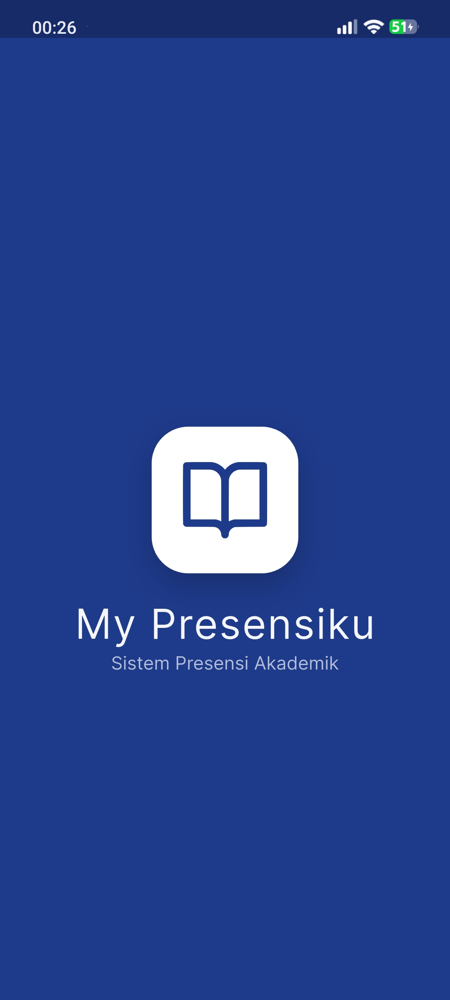
  
  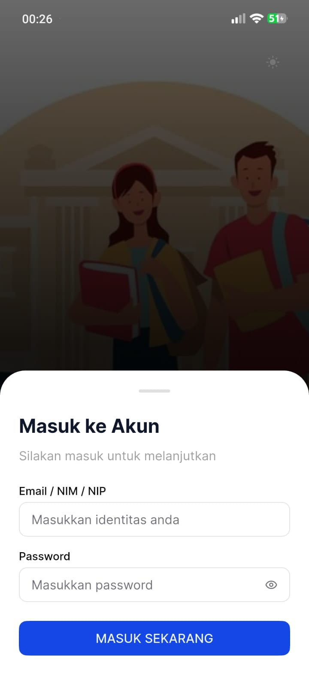
</div>

### 2. Dasbor Berdasarkan Role

Aplikasi mendukung _Light/Dark Mode_ dan menyesuaikan tampilan Dasbor berdasarkan _role_ pengguna (Admin, Dosen, atau Mahasiswa). Admin dapat mengatur konfigurasi semester awal, mengubah tema, maupun membuka profil modal.

<div style="display: flex; flex-wrap: wrap; gap: 10px;">
  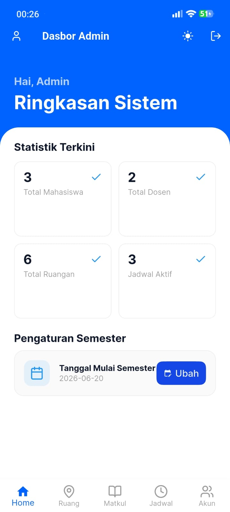
  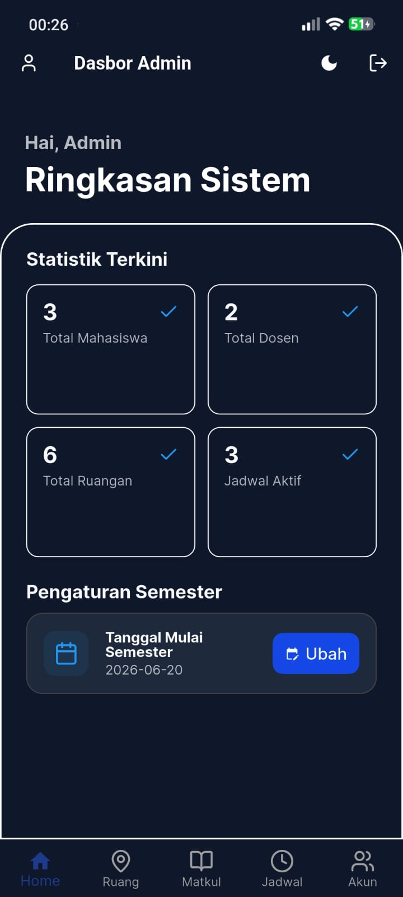
  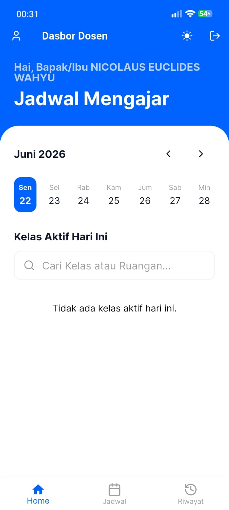
  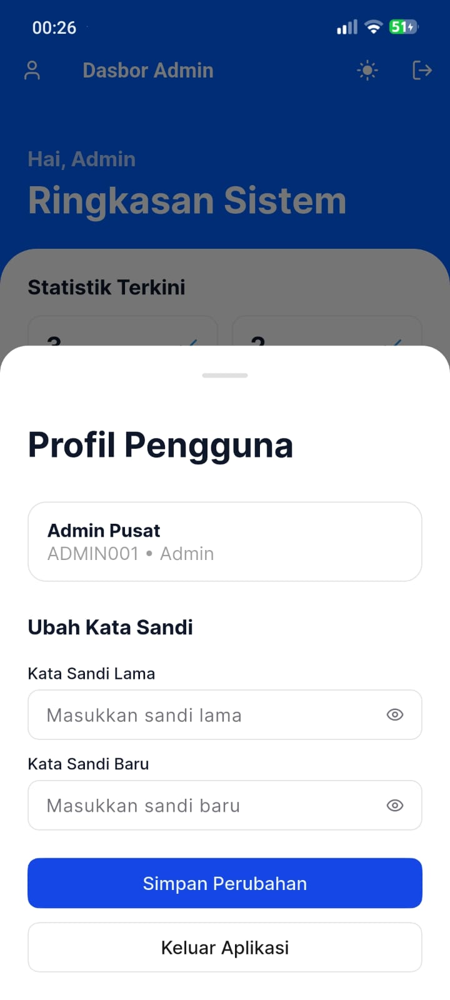
</div>

### 3. Pengelolaan Master Data oleh Admin (CRUD)

Admin memiliki hak akses penuh dalam mengelola master data seperti **Pengguna**, **Mata Kuliah**, dan **Ruangan**. Penambahan ruangan sudah mendukung **Location Picker** (_Map_) untuk menentukan koordinat presensi.

<div style="display: flex; flex-wrap: wrap; gap: 10px;">
  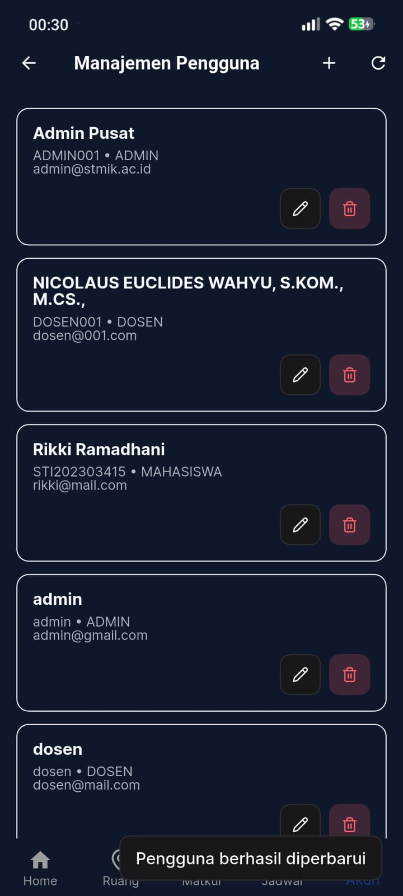
  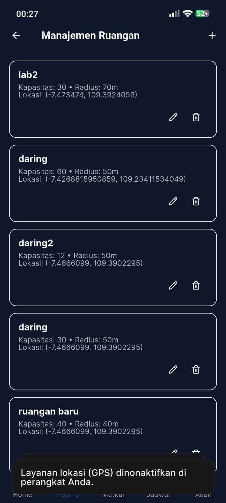
  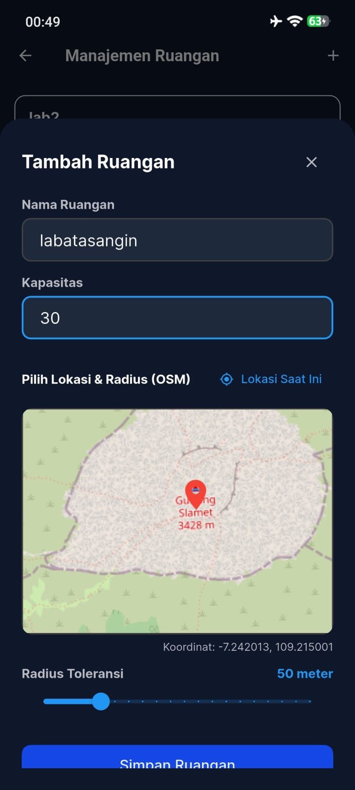
  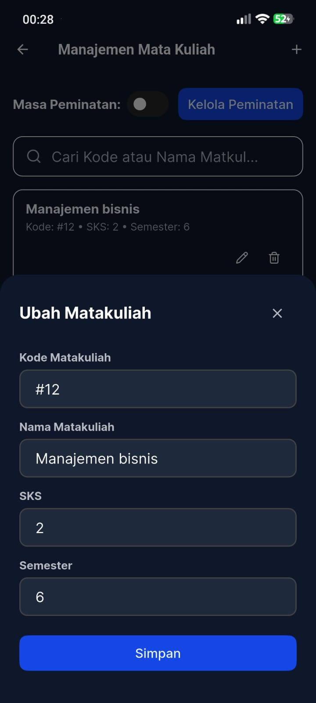
</div>

### 4. Manajemen Jadwal, Peminatan, dan Laporan Rekap

Admin dapat mengelola kelas dan jadwal, meninjau laporan rekap kehadiran kelas (termasuk grafik statistik), serta memvalidasi peminatan mahasiswa terhadap mata kuliah tertentu.

<div style="display: flex; flex-wrap: wrap; gap: 10px;">
  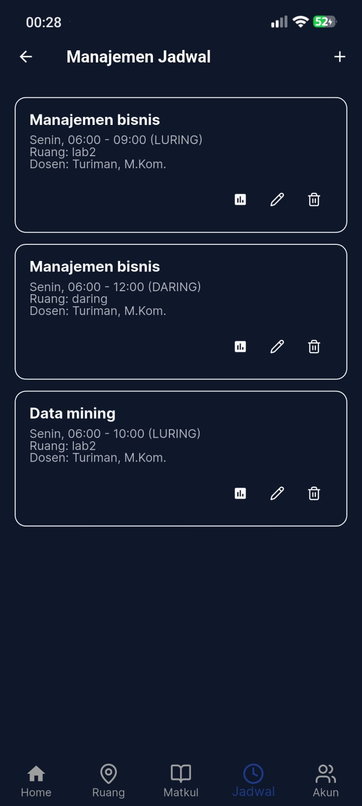
  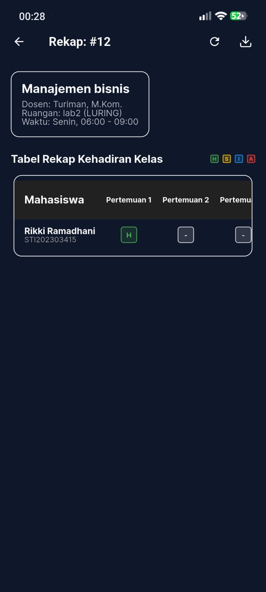
  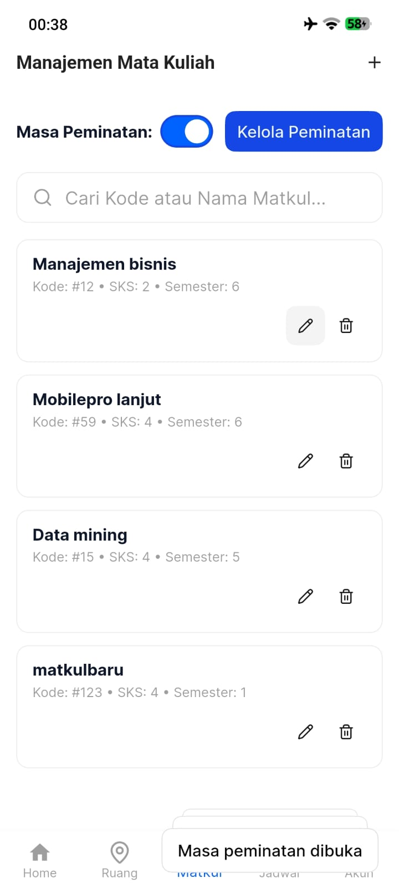
  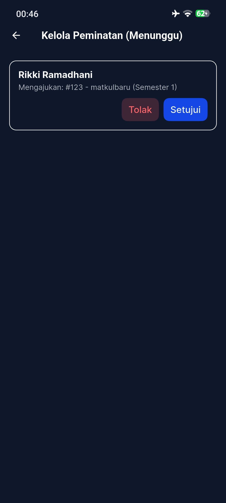
</div>

### 5. Proses Presensi (Generate QR & Scan GPS)

**Sisi Dosen**: Memilih kelas yang berjalan dari daftar jadwal kelasnya, kemudian melakukan **Generate QR Code** di kelas tersebut.
**Sisi Mahasiswa**: Mahasiswa melakukan **Scan QR Code**. Sistem akan memverifikasi lokasi GPS mahasiswa dengan batas radius ruang kelas. Jika berhasil, riwayat akan tercatat. Jika di luar jangkauan, aplikasi akan menampilkan gagal presensi.

<div style="display: flex; flex-wrap: wrap; gap: 10px;">
  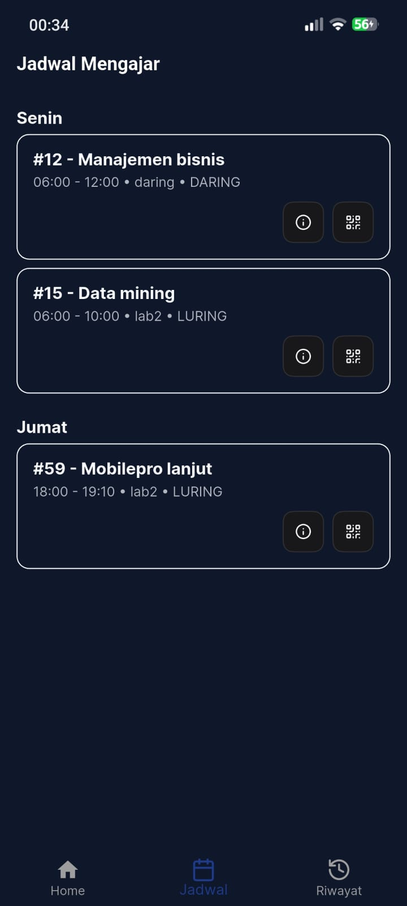
  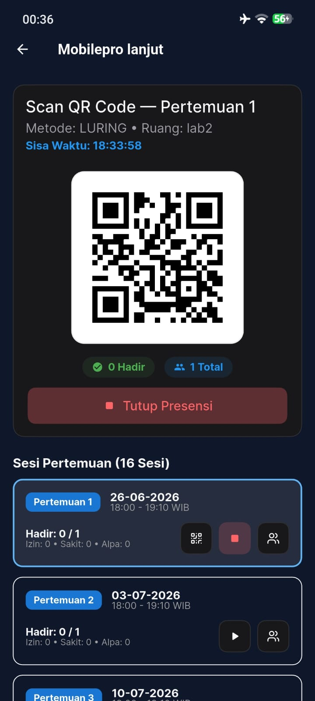
  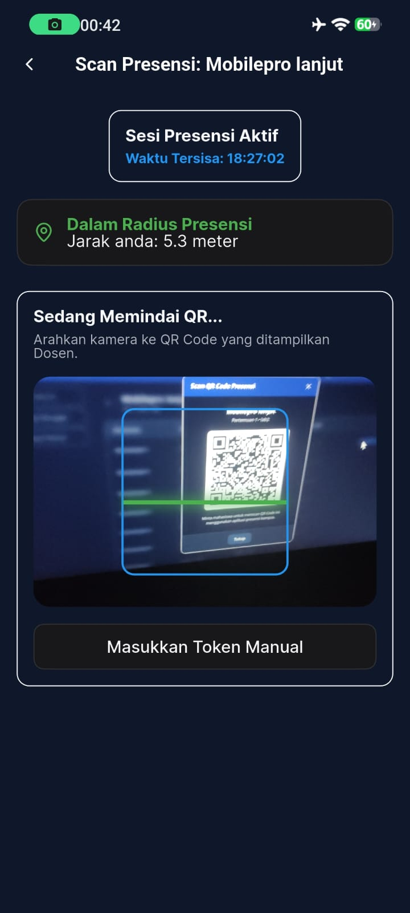
  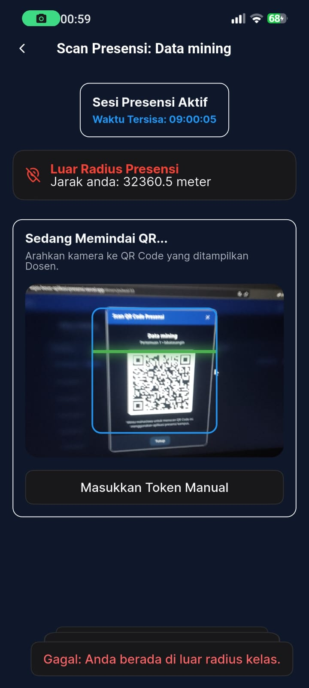
</div>

### 6. Riwayat Kehadiran Mahasiswa

Mahasiswa bisa melihat rincian presensinya secara _real-time_. Terdapat indikator khusus jika presensinya **Berhasil** masuk ke dalam server dengan tepat waktu.

<div style="display: flex; flex-wrap: wrap; gap: 10px;">
  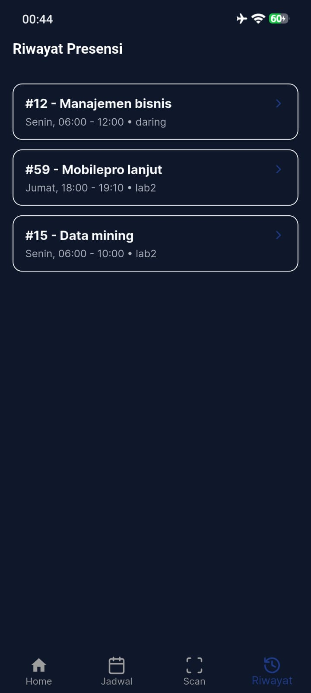
  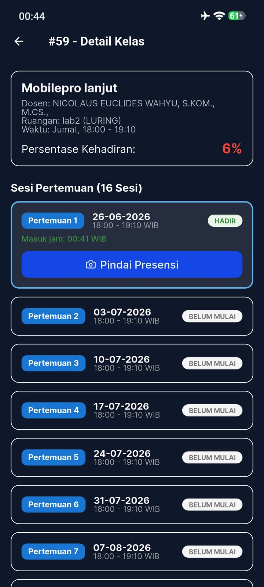
</div>
